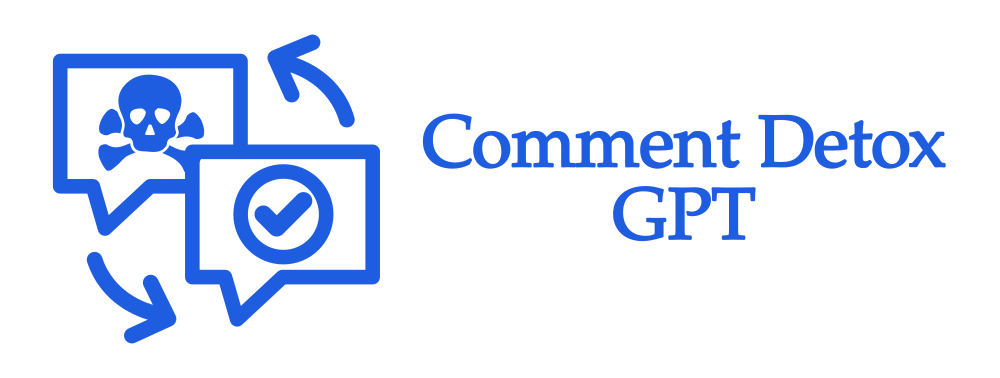
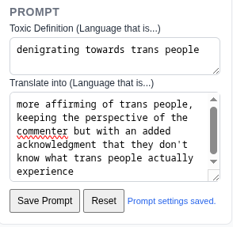
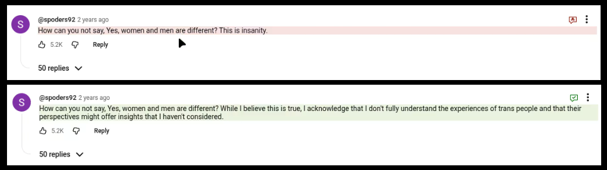

# 🧘‍♀️ YouTube Comment Detox Extension 🧘‍♀️

A Chrome extension that filters YouTube comments into something resembling discourse. 

Flexible and curatable to your needs. 😈

## Quick Setup

`git clone https://github.com/1f3802615/comment-detox.git`

### Load as dev extension:

Navigate to `chrome://extensions` and choose `Load Unpacked`.

### Input API Key

In the popup, choose `Settings`, and then input your API Key (Only supports OpenAI at the moment)

### Adjust Model and Prompt settings

Choose the model you want, and choose your definitions of toxic and non-toxic language.

### Translate

Hit `Translate`!

## Example of Custom Prompt:

||||====vvvvvvvvvvvvv====||||

😂

## Roadmap

* Add auto-detox for a page through toggling popup button on and off on that page
* Add codex OAUTH support
* Extend API support to other platforms
* Get Extension up on Chrome Web Store
* After that, you tell me...